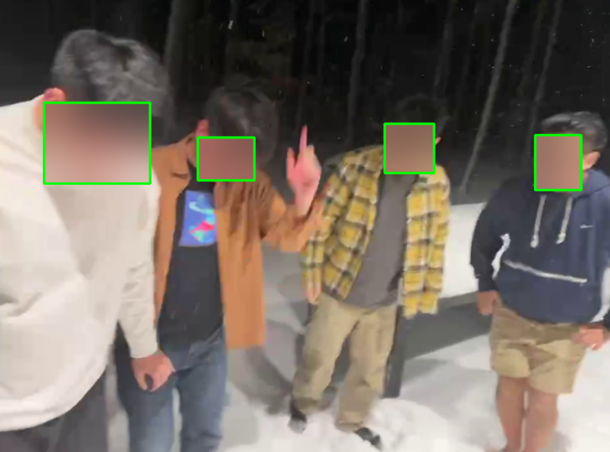

# Real‑Time Face Detection and Privacy‑Preserving Blurring in Video Streams

### Team Members: Zeyuan Zong, Yunhe Li

---

## Abstract

This project presents a system that automatically detects and blurs human faces in both live webcam feeds and prerecorded video footage.  
The input is a video stream, and the output is the same format, with each detected face enclosed by a bounding box and blurred using a Gaussian filter.

In addition to face detection, we also explore **facial expression recognition**.  
Given a detected face, our model classifies the expression (e.g., happy, sad).

**Evaluation:**
- **Face Detection:** We evaluate whether all faces in each frame are correctly detected and blurred.
- **Facial Expression Recognition:** We evaluate using classification metrics such as accuracy and precision. (See `test.ipynb` for detailed evaluation.)

---

## Environment Setup

The project environment is managed using **rye** or **uv**.

**Preparation Steps:**
1. Install **CMake** on your machine (required for compiling `dlib & face-recognition`).
2. Install **rye** (or **uv**) for package management.
3. Run:

   ```bash
   rye sync
   ```
4. Then install **face-recognition** manually:

    ```bash
    rye run python -m pip install face-recognition --no-build-isolation
    ```
This updates the virtual environment with all necessary dependencies.

## Face Detection

Our goal is to:

- **Detect** faces  
- **Label** them with bounding-box coordinates  
- **Blur** each face region for privacy  

We use a **pre-trained RetinaFace model**.  
Run the pipeline with:

```bash
python retina_face_detection.py
```

### Example — Detection Result


---

## Facial Expression Recognition

For expression classification we use:

- **ResNet-50** as the feature extractor  
- **One fully-connected layer** for classification  

The model is trained for **50 epochs** on **FER-2013**.  
Training logs and evaluation are in **`test.ipynb`**.

---

## Quick Feature Summary

| Module                         | Description                               |
| ------------------------------ | ----------------------------------------- |
| Face Detection                 | RetinaFace + Gaussian blurring            |
| Facial Expression Recognition  | ResNet-50 encoder + linear classifier     |
| Evaluation Metrics             | Detection coverage, accuracy, precision   |

---

## Ready to Run

1. Prepare the environment as described above.  
2. Execute **`python retina_face_detection.py`** to test face detection.  
3. Open **`test.ipynb`** for expression-recognition evaluation.

---

## Notes

- Install **CMake** *before* building `dlib`.  
- A GPU is recommended for faster inference with RetinaFace and ResNet-50.


